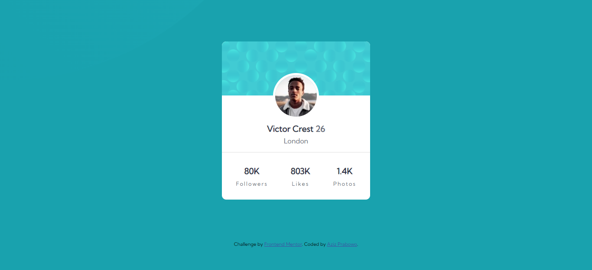

# Frontend Mentor - Profile card component solution

This is a solution to the [Profile card component challenge on Frontend Mentor](https://www.frontendmentor.io/challenges/profile-card-component-cfArpWshJ). Frontend Mentor challenges help you improve your coding skills by building realistic projects.

## Table of contents

- [Overview](#overview)
  - [The challenge](#the-challenge)
  - [Screenshot](#screenshot)
  - [Links](#links)
- [My process](#my-process)
  - [Built with](#built-with)
  - [What I learned](#what-i-learned)
- [Author](#author)

## Overview

### The challenge

- Build out the project to the designs provided


### Screenshot



### Links

- Solution URL: [SOLUTION](https://www.frontendmentor.io/solutions/responsive-profile-card-using-css-flexbox-EQNmes2KZ0)
- Live Site URL: [LIVE SITE](https://azizp128.github.io/profile-card/)

## My process

### Built with

- Semantic HTML5 markup
- CSS custom properties
- Flexbox
- Mobile-first workflow

### What I learned

I leaarned about image absolute position & responsive design in this challenge.

To see how you can add code snippets, see below:

```css
.card .card-image {
  border: 5px solid white;
  border-radius: 50%;
  position: absolute;
  left: 0;
  right: 0;
  top: 27%;
  margin: 0 auto;
}
```

## Author

- Frontend Mentor - [@azizp128](https://www.frontendmentor.io/profile/azizp128)
- Twitter - [@aziprbw](https://www.twitter.com/azizprbw)
